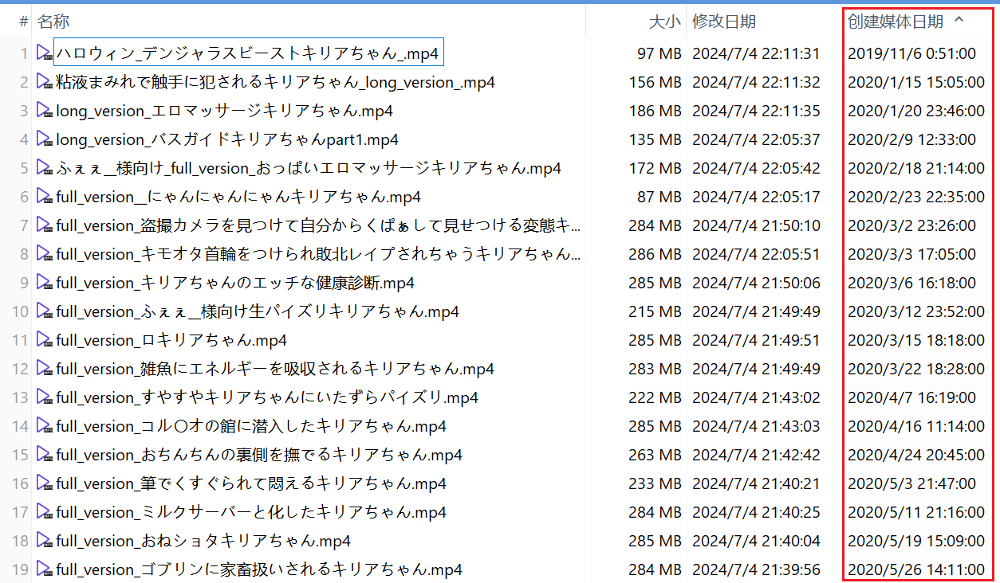
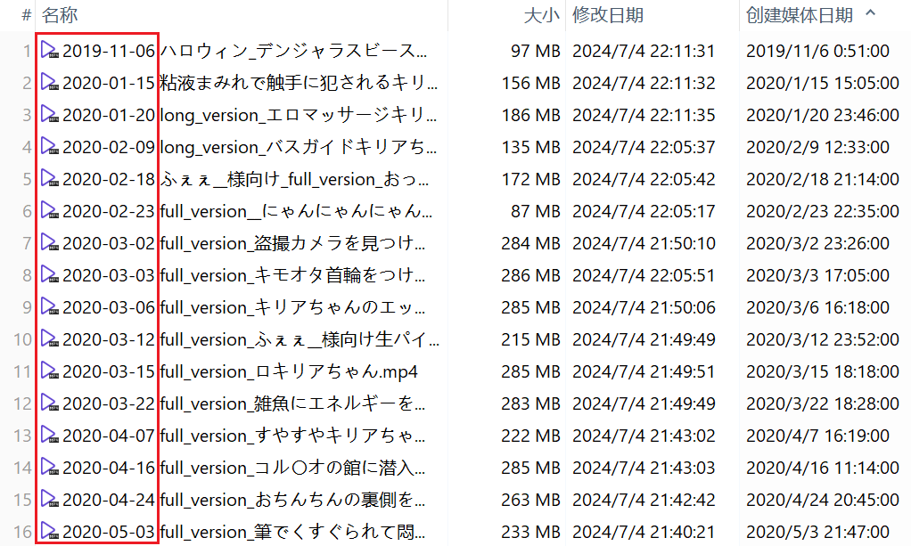

# Rename Video Files Using Media Create Date

这是一个 Python 脚本，可以使用媒体创建日期来重命名视频文件。

## 适用场景

如果一些视频的修改日期不是原始值，同时它的“媒体创建日期”是原始值，那么可以使用“媒体创建日期”来重命名。

例如下图的情况：



## 效果

该脚本会在原文件名前面添加媒体创建日期，效果如下：



说明：
- 该脚本会对它所处的文件夹进行遍历，并处理里面所有的 MP4 和 MKV 文件；
- 如果文件没有可用的“媒体创建日期”的值，则不会对该文件重命名。
- 这个脚本会把原始的 UTC 时间转换为本地时间。默认的时区是上海，如果你想使用其他时区，请手动更改代码。

## 使用

下载 r.py，并将它移动到要重命名的视频所在的文件夹。

环境变量里需要有 Python 和 ExifTool。

在首次使用之前，还需要安装依赖：

```
pip install pytz
```

之后在命令行里定位到该文件夹，并执行：

```
python r.py
```

符合条件的视频文件会自动重命名。

如果一切正常，什么都不会输出，因为它只会输出错误信息。

执行完毕后，如果有一些文件并未重命名，你可以把它们移动到一个单独的文件夹里，然后把 r.py 也放进去，再次执行 `python r.py`。

-----------

如果文件名中的某些特殊字符导致 ExifTool 显示如下错误：

```
FileName encoding not specified.  Use "-charset FileName=CHARSET"
```

请参考 [stackoverflow 上的解决办法](https://stackoverflow.com/questions/57131654/using-utf-8-encoding-chcp-65001-in-command-prompt-windows-powershell-window)。
